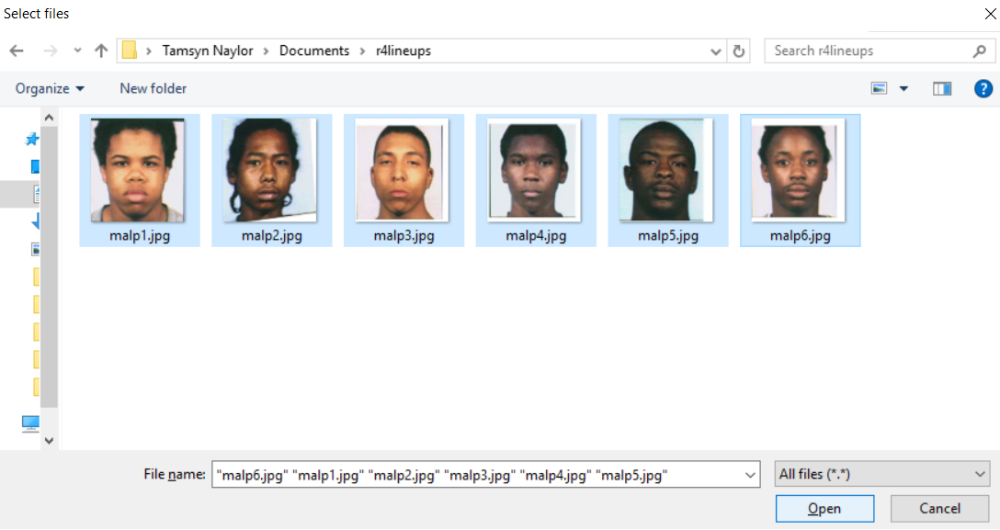
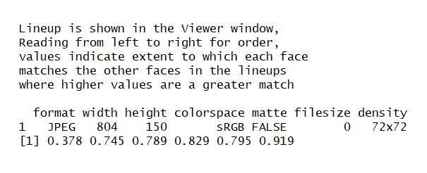

```{r setup, include = FALSE}
knitr::opts_chunk$set(
  collapse = TRUE,
  comment = NA
)
```

This package contains functions to compute various estimates of lineup fairness, allowing eyewitness testimony researchers to reason inferentially about several well-known measures of lineup fairness developed in psychological research. 

The measures described below were developed by _______ (see References). Several other functions contained in this package are variations of measures of lineup fairness adapted from (refs), and modified by Professor Colin Tredoux. 


## Data Format

The majority of r4lineups functions require a vector of numeric lineup data, whilst other functions require the user to pass a list of lineup data. It is advisable to read the documentation to determine the format of data needed by each specific function. Most r4lineups functions will not work with a dataframe, even if the dataframe contains only one vector. If your lineup data is in dataframe format already, you can easily convert it to a vector or a list. 

```{r,}
library(r4lineups)
data(CGTmock)
```

```{r, echo=FALSE, results='asis'}
pander::pandoc.table(CGTmock[1:3,], "CTGmock data")
```

* For functions that require data for only one lineup or one lineup pair, you can convert the data from a given lineup to a vector by calling `lineup_vec <- CGTmock$lineup_1` or alternatively `lineup_vec <- CGTmock[[1]]`

* For functions that require several lineups or several lineup pairs, you can convert the data to a list by calling `lineup_list <- as.list(CGTmock)`
    
```{r, include=FALSE}
lineup_vec <- CGTmock$lineup_1
lineup_list <- as.list(CGTmock)
```

* __Nominal Size__

    Functions relying on nominal size for accurate calculations require the user to manually specify nominal size. If nominal size, as specified by the user, is not reflected in the dataframe or vector passed to the function, execution of the function is halted with the following error message: _"User-declared nominal size does not match observed nominal size. Please check vector of target positions."_"

-----

## Lineup Proportion

Proportion refers to the proportion of witnesses selecting a particular member of a lineup. This package provides calculations of proportion for individual lineup members, and for all members of a lineup. 

### Calculating proportion for a single target/lineup member:
```{r}
library(r4lineups)

lineup_prop_vec(lineup_vec, 3, 8)
```
The function returns a proportion indicating the frequency with which the target/linuep member occupying position 3 in the lineup was identified by 14.29% of the witnesses, or 14.29% of the time. 

* _Compute bootstrapped estimates:_

    To calculate boostrapped lineup proportion for a single lineup member, we pass the `lineup_prop_boot` function as an argument to the `boot` function supplied by the package 'boot':

```{r, indent = "  ", warning=FALSE,}
bootobject <- boot::boot(lineup_vec, lineup_prop_boot, target_pos = 3, R = 1000)
bootobject
```

    + _We then compute confidence intervals:_

```{r, indent = "  ", warning=FALSE}
cis <- boot::boot.ci(bootobject, conf = 0.95, type = "all")
cis
```

### Calculating proportion for each lineup member

Should the user want to calculate proportion for each member of a given lineup, the `allprop` function can be called. Instead of the user specifying the target position, a vector indexing all target positions is passed to the function. This can be manually generated by calling `target_pos <- c(1:k)`.

```{r, echo=FALSE  }
target_pos <- c(1:8)
```
```{r}
allprop(lineup_vec, target_pos, 8)
```


* _Compute bootstrapped estimates:_

```{r, indent = "  "}
lineuprops.ci <- lineup_boot_allprop(lineup_vec, target_pos, 8)
lineuprops.ci
```

&nbsp; _Note_: _k_ = nominal size, and must be explicitly declared by the user (for more info, see the __Data Format__ section, above).

---

## Functional Size

* To compute functional size with confidence intervals, we call `func_size_report`, and pass a vector of lineup data, as well as one scalar indicating target position, and another indicating nominal size:

```{r, indent = "  "}
func_size_report(lineup_vec, 3, 8)
```

   
---

## Effective Size

This package allows the user to calculate effective size in several different ways. 

1. __Malpass's original (1981) & adjusted effective size (see: Tredoux, 1998)__

    Effective size can be computed by calling the `esize_m` function and passing a    table of lineup data. If printarg = FALSE, only Malpass's adjusted formula for effective size is used. If both = TRUE, both Malpass's original and adjusted calculations of effective size are returned. The user must also specify nominal size.

```{r}
esize_m(table(lineup_vec), k = 8, both = TRUE)
```
    
* _Compute bootstrapped estimates (Malpass's adjusted):_

```{r,indent = "  "}
#Create a dataframe of bootstrapped lineup data
bootdata <- gen_boot_samples(lineup_vec, 1000)

#Calculate effective size for each lineup in bootdata
#Nomiinal size is again declared by user
lineupsizes <- gen_esize_m(bootdata, 8)

#Calculate lower and upper CIs with desired level of alpha
gen_esize_m_ci(lineupsizes, perc = .025)
gen_esize_m_ci(lineupsizes, perc = .975)
```
* _Compute bootstrap descriptive statistics (Malpass's adjusted):_
```{r}
gen_boot_propmean_se(lineupsizes)
```


2. __Effective Size Per Foils__

    To calculate effective size by counting the number of foils who fall within the CI for chance guessing, we pass a vector of lineup data, a vector of target positions and nominal size. This function returns effective size from a set of bootstrapped data. Default alpha is 0.05, but this can be adjusted as desired.
```{r}
eff_size_per_foils(lineup_vec, target_pos, 8, conf = 0.95)
```

### Comparing two effective sizes

To test if the effective size of 2 independent lineups are significantly different from one another, we take the difference between said effective sizes and calculate CIs. This function requires a dataframe containing lineup data for 2 independent lineups. Here, we create a new dataframe containing 2 independent lineups from `CGTmock`.

```{r}
#Get data
linedf <- CGTmock[1:2]

#Compare effective size
effsize_compare(linedf)
```
The effective size for lineup_1 is therefore not significantly different from the effective size for lineup_2.

---

## Diagnosticity Ratio

We can calculate diagnosticity ratio for a set of identification parades using either `diag_ratio_W` for Wells & Lindsay's (1980) diagnosticity ratio formula, or `diag_ratio_T` for Wells's adjusted diagnosticity ratio (see: Tredoux, 1998. 

* Both functions require the same set of arguments: a vector of lineup choices in which the target was present (TP), a vector of lineup choices in which the target was absent (TA), as well as target positions and nominal size for TP and TA lineups, respectively. These last arguments are declared by the user. 

```{r, indent = "  "}
#Target present & target absent lineup data for 1 lineup pair 
TP_lineup <- CGTmock$lineup_1
TA_lineup <- CGTmock$lineup_3

#Compute diagnosticity ratio
diag_ratio_W(TP_lineup, TA_lineup, pos_pres = 3, pos_abs = 7, k1 =8, k2 = 8)
diag_ratio_T(TP_lineup, TA_lineup, pos_pres = 3, pos_abs = 7, k1 =8, k2 = 8)

```
* We can also calculate the variance of the diagnosticity ratio:
```{r, indent = "  "}
var_diag_ratio(TP_lineup, TA_lineup, 3, 7, 8, 8)
```
_Note:_ `var_diag_ratio` relies on Wells & Lindsay's original formula for computing diagnosticity ratio.

### Differences between Independent Diagnosticity Ratios

The functions included in this package are based on an approach to calculating homogeneity for k independent diagnosticity ratios, as detailed in Tredoux (1998).

#### Calculate homogeneity for _k_ independent diagnosticity ratios, using normal theory estimates

The homogeneity function requires a dataframe containing the specific parameters used in the estimation diagnosticity ratio homogeneity. For each set of identification parades (i.e., each lineup pair), we need to calculate the natural log of the diagnosticity ratio (referred to here as lnd), its' variance (var_lnd), and a weight for each ratio that is equal to the inverse of its variance (wi). This is used to calculate a pooled estimator (i.e., the mean of the set of diagnosticity ratios). From this, we compute a chi-square deviate with _k_-1 degrees of freedom, and calculate its significance.

All these calculations are built into the homog_diag function, and so do not need to be calculated separately. The user must pass a dataframe of lnd, var_lnd and wi to homog_diag, and all subsequent calculations are performed on this dataframe.

To get the dataframe required by `homog_diag`, we follow the following steps:

1. For each lineup pair, load data for TP and TA lineups onto separate vectors. Then, make a list containing all vectors for TP lineups, and another containing the TA lineups. The positions of each lineup pair should correspond in each list.

    * For example, if the first element of the TP lineup list is TP lineup data for lineup pair 1, then the first element of the TA lineup list should be the TA lineup data for lineup pair 1. 

```{r, indent = "  "}
#Target present data:
TP_lineup1 <-  round(runif(100,1,6))
TP_lineup2 <-  round(runif(70,1,5))
TP_lineup3 <-  round(runif(20,1,4))
lineup_pres_list <- list(TP_lineup1, TP_lineup2, TP_lineup3)

#Target absent data:
TA_lineup1 <-  round(runif(100,1,6))
TA_lineup2 <-  round(runif(70,1,5))
TA_lineup3 <-  round(runif(20,1,4))
lineup_abs_list <- list(TA_lineup1, TA_lineup2, TA_lineup3)

```
2. Next, the function requires a list of target positions for each lineup pair. For each set of TP/TA data in the TP/TA lists, there should be a corresponding target position list.

    * Each target position indexes the position of each member in the lineup. Therefore, it's length should = k for that lineup pair. 

```{r}
lineup1_pos <- c(1, 2, 3, 4, 5, 6)
lineup2_pos <- c(1, 2, 3, 4, 5)
lineup3_pos <- c(1, 2, 3, 4)
pos_list <- list(lineup1_pos, lineup2_pos, lineup3_pos)
```

3. To ensure the data have been coded accurately, we then specify nominal size for each lineup pair. The order in which nominal size for each lineup pair is listed must also correspond with the positions of each respective lineup in the lineup lists (i.e., if lineup 1 has _k_ = 6, then the first element of vector 'k' = 6). Following the example above, we create our nominal size vector k by calling `k <- c(6, 5, 4)`

4. Finally, we pass the above arguments/data to `homog_diag`, which assesses the homogeneity of k independent diagnosticity ratios.
```{r, include = FALSE}
k <- c(6, 5, 4)
```

```{r, warning=FALSE}
homog_diag(lineup_pres_list, lineup_abs_list, pos_list, k)
```

#### Calculate homogeneity for _k_ independent diagnosticity ratios, with bootstrapped confidence intervals

This function returns bootstrapped estimates of homogeneity of k diagnosticity ratios, and therefore takes the same arguments as `homog_diag` (which provides normal theory estimates). 

This function does not require the user to specify a list of target positions (this is generated from the data).

Thus, we follow steps 1 & 3, outlined above, before calling `homog_diag_boot`:
```{r, warning=FALSE}
homog_diag_boot(lineup_pres_list, lineup_abs_list, k, R=100)
```
_Note:_ R = number of bootstrap replications

---

## ROC Curve (Confidence ~ Accuracy)

This function allows the user to compute and plot an ROC curve for data from an eyewitness experiment, where accuracy is recorded for target present and target
absent lineups. 

This function operates via a dialog box which asks users to select a list of images for processing.  

1. This function requires dataframe with two columns, named confidence and accuracy (where accuracy = binary accuracy):

```{r, echo = F, results='asis'}
#Load ROC data: mickwix sample data
data(mickwix)
pander::pandoc.table(mickwix[1:8,], "Confacc data")
```
```{r, fig.cap= "ROC Curve for Confidence ~ Accuracy", fig.width= 5}
#Call roc function
make_roc(mickwix)
```

---

## Similarity of Faces in a Lineup

This function computes the degree to which each face in a set of faces loads onto a common factor computed from said faces. 

* Without passing any arguments, call `face_sim`:

    * A dialog box will appear, through which the user may access the OS's file explorer. Navigate to the folder in which the images are stored, select all, and open.

     _Note:_ Each image should be of one face only. 
    
    The images used in this vignette can be found in the data subdirectory for this 
            package.

```{r, echo=FALSE}

```

* The function will now process the selected images, printing the lineup array to the viewer pane in RStudio, and reporting the loading of each face on the first common factor in a factor analysis:


```{r, echo = FALSE, fig.cap= "Set of faces is printed to viewer pane"}
knitr::include_graphics("lineupimage2.jpg", dpi = 100)
```


```{r, echo = FALSE, fig.cap= "Returns factor loading for each face"}

```

---
