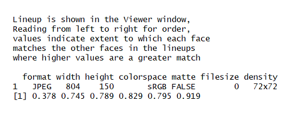

```{r setup, include = FALSE}
knitr::opts_chunk$set(
  collapse = TRUE,
  comment = NA
)
```

This package contains functions to compute various properties of laboratory or police lineups.  
  Since the early 1970s eyewitness testimony researchers have recognised the importance of estimating properties such as lineup bias (is the lineup biased against the suspect, leading to a rate of choosing higher than one would expect by chance?), and lineup size (how many reasonable choices are in fact available to the witness? A lineup is supposed to consist of a suspect and a number of additional members, or foils, whom a poor quality witness might mistake for the perpetrator).
  Lineup measures are descriptive, in the first instance, but since the earliest articles in the literature researchers have recognised the importance of reasoning inferentially about them.
 
The measures described below were originally proposed by Doob & Kirshenbaum (1973), Wells, Leippe & Ostrom (1979), Malpass (1981), Tredoux (1998, 1999), and Malpass, Tredoux & McQuiston-Surrett (2007).  Most of the measures assume that a sample of mock witnesses has been given a description of the perpetrator, and a lineup, and asked to choose someone from the lineup (either as the best match to the description, or the best match to the lineup member the police likely have in mind; see Malpass et al., 2007)

Much of the justification for what follows can be found in Tredoux (1998), and Malpass et al. (2007)


## Data Format

The majority of functions in **r4lineups** require a numeric *vector* representing lineup data, whilst other functions require you to pass a *list* of lineup data. It is advisable to read the documentation to determine the format of data needed by each specific function. Most **r4lineups** functions will not work with a dataframe, even if the dataframe contains only one column, and thus appears to be in vector like format. If your lineup data is in dataframe format already, you can easily convert it to a vector or a list. 

For instance, if we have 10 mock witnesses, and each views a lineup with 6 members, then we could record their choices as a numeric vector, where the elements represent the position of the lineup member chosen by each witness:

`lineup_vec <- c(3, 2, 5, 6, 1, 3, 3, 5, 6, 4)`

However, it is also possible to represent this set of choices as a one-dimensional table:

`lineup_tbl <- table(lineup_vec)`

If we had our lineup choices recorded in a data frame, which is what we might end up with if we import the data from a spreadsheet program, then we could easily extract the variable representing choices in the dataframe into a vector.

For instance, if the lineup choices shown above for 10 mock witnesses were part of a larger dataset, and we had recorded the ages and participant number of each participant, then the dataframe might appear as shown below (we create the dataframe below with simulated data here, though)

`participant_num <- paste("Partic_",1:10, sep = "")`
`age             <- round(runif(10, 18, 80), 2)`
`line_df         <- data.frame(participant_num, age, lineup_vec)`

Show the dataframe:

`line_df`

Extract the lineup choices, per participant, to a vector:
`a_lineup_vec <- line_df$linep_vec`

Or make a table directly from the variable of choices:
`a_lineup_table <- table(line_df$lineup_vec)`

One **important** issue is that there is no way of the functions in this package knowing if some of the members of a lineup received no choices.  In other words, if there were in fact 7 lineup members in our running example, but member 7 was not chosen by any witnesses, then this would not be evident from the lineup vector, since it records the choice made by each witness, but not the number of lineup members. To deal with this problem, generally the functions in the package require nominal lineup size (the number of physical members of the lineup) to be passed as an argument.

Let's look at a slightly larger data set:

```{r,}
library(r4lineups)
data(nortje2012)
```

```{r, echo=FALSE, results='asis'}
pander::pandoc.table(nortje2012[1:3,], "nortje2012 data")
```

* For functions that require data for only one lineup or one lineup pair, you can convert the data from a given lineup to a vector by calling for e.g. `lineup_vec <- nortje2012$lineup_1` or alternatively `lineup_vec <- nortje2012[[1]]`

* For functions that require several lineups or several lineup pairs, you can convert the data to a list, e.g.,  `lineup_list <- as.list(nortje2012)`
    
```{r, include=FALSE}
lineup_vec   <- nortje2012$lineup_1
lineup_list  <- as.list(nortje2012)
lineup_table <- table(lineup_vec)
```

* __Nominal Size__

    The notion of 'Nominal size' refers to the number of physical members of a lineup. 
    Functions relying on nominal size for accurate calculations require you to manually specify nominal size. If the specified nominal size is not reflected in the dataframe or vector passed to the function, execution of the function is halted with the following error message: _"User-declared nominal size does not match observed nominal size. Please check vector of target positions."_

-----

## r4lineups Sample Datasets

This package contains several sample datasets, listed below:

1. `nortje2012`: A dataframe of lineup choices for 3 independent lineups, from a study conducted by Nortje 
                   & Tredoux (2012)
2. `line73`   : Lineup data from Doob & Kirshenbaum (1973) 
3. `mockdata`: Lineup data from a study conducted by Nortje & Tredoux (2012)
4. `mickwick` : Confidence and accuracy data for lineup choices. Sample data to be passed to ROC function `make_roc()`
5. Foil images (used to demonstrate `face_sim`) can be found at https://github.com/tmnaylor/malpass_foils 

All sample datasets can be loaded by calling `data(sample_data)`. Further details can be found in the documentation for each dataset. 

---

## Lineup Proportion

Proportion refers to the proportion of witnesses selecting a particular member of a lineup. This package provides calculations of proportion for individual lineup members (`lineup_prop_vec()`), and for all members of a lineup with a subsidiary function (`allprop()`).

The calculation of the proportion of mock witnesses choosing the suspect is essentially a measure of lineup bias (see Malpass, 1981; Tredoux, 1998), especially when one tests whether it exceeds the proportion expected by chance guessing alone (1/nominal_size).

### Calculating proportion for a single target/lineup member:
```{r}
library(r4lineups)

lineup_prop_vec(lineup_vec, target_pos = 3, k = 8)
```

This function requires three arguments: a vector of lineup data, the position of the target in the lineup (target_pos), and nominal size (k). The example use of the function here returns the proportion of mock witnesses choosing the target/linuep member occupying position 3 in the lineup, and is 0.14% of the witnesses. 

* _Compute bootstrapped estimates:_
The original work on lineup bias suggested testing whether the computed proportion = 1/nominal_size using a z test of proportions, or a binomial probability (see Tredoux, 1998), or a confidence interval around the proportion (see Tredoux, 1998), but very few studies actually use enough mock witnesses to strongly warrant this approach, since it assumes approximation to a normal distribution, and the size of the lineup places hard limits that are often not observed by computed confidence intervals.
    We therefore recommend computing bootstrapped estimates of all lineup measures, and especially the sampling variability around estimates.
    To calculate a boostrapped lineup proportion for a single lineup member, we pass the `lineup_prop_boot()` function as an argument to the `boot()` function supplied by the package 'boot'.  We do not work directly with the lineup_prop_boot function, all we need to know to bootstrap is the lineup vector, the position of the target (target_pos), and the number of bootstrap resamples we desire (R).

```{r, indent = "  ", warning=FALSE,}
bootobject <- boot::boot(lineup_vec, lineup_prop_boot, target_pos = 3, R = 1000)
bootobject
```

    + _We then compute confidence intervals:_

```{r, indent = "  ", warning=FALSE}
cis <- boot::boot.ci(bootobject, conf = 0.95, type = "bca")
cis
```

If you are not familiar with how the boot or the boot.ci functions work, you could consult the documentation for the boot package. However, by using the functions as shown here you will be able to bootstrap without needing to understand them in detail. 
Briefly, the argument 'conf' allows you to specify the significance level, alpha, and 'type' specifies the type of confidence interval to be returned. If type = "bca", the function will return bias-corrected confidence intervals.

### Calculating proportion for each lineup member

Should you want to calculate a proportion for each member of a given lineup, the `allprop()` function can be called. This might be the case when there is no pre-specified suspect in the lineup, as some researchers do in laboratory experiments.  Instead of manually specifying the target position, a vector indexing all target positions is automatically generated from the argument 'k', within the function itself.

```{r}
allprop(lineup_vec, k = 8)
```
The function then returns proportion of mock witnesses selecting each lineup member. 

* _Compute bootstrapped estimates:_

    We can generate bootstrap estimates for all the computed proportions, too, with `lineup_boot_allprop()`.

    This function takes a vector of lineup data, a vector indexing target positions, and nominal size.

```{r, indent = "  "}
lineuprops.ci <- lineup_boot_allprop(lineup_vec, target_pos, k = 8)
lineuprops.ci
```
The object `lineuprops.ci` is a dataframe of 2 columns and k rows, in which columns 1 and 2 contain lower and upper confidence intervals, respectively, and the number of rows = nominal size. 

&nbsp; _Note_: _k_ = nominal size, and must always be explicitly declared (for more info, see the __Data Format__ section, above).

---

## Functional Size

We defined nominal size above as the number of physical members of a lineup, but it is clear from experience that not all lineup members are good foils, and some might not end up being chosen at all.  They are not good tests of witness memory, in short.  Wells et al. (1979) proposed the notion of 'functional size' as a measure of the number of plausible lineup members, and defined it as the inverse of the proportion of mock witnesses choosing the suspect.

Functional size = $\frac{D}{N}$

You can compute functional size by inverting the result of the `lineup_prop_vec()` function, or by calling `func_size`, but we suggest you use the function `func_size_report()` which provides more detail, including bootstrapped confidence intervals.

* To compute functional size with confidence intervals,  call `func_size_report()`, and pass a vector of lineup data, as well as one scalar indicating target position, and another indicating nominal size:

```{r, indent = "  "}
func_size_report(lineup_vec, target_pos = 3, k = 8)
```

   
---

## Effective Size

The measure of functional size proposed by Wells et al. (1979) does not take the choosing rates of foils other than the suspect into account, and Malpass (1981) thus proposed a measure of the number of plausible lineup foils that takes all the data from a lineup table into account.  He called this measure 'effective size'.  

Malpass' Effective size A = $k_{a}-\sum_{i=1}^{k_{a}}\frac{|o_{i}-e_{a}|}{2e_{a}}$

where $o_{i}$ is the (observed) number of mock witnesses who choose lineup member
i; $e_{a}$ is the adjusted nominal chance expectation [N(l/$k_{a}$)], and $k_{a}$ is the adjusted nominal number of alternatives in the lineup (original number-number of null
foils)

Malpass' measure of effective size poses problems for statistical inference based on distribution theory, though, as argued by Tredoux (1998).  He instead proposed an alternate measure of effective size, known as E', derived from earlier work by Agresti and Agresti (1978).

This package allows you to calculate effective size in several different ways. 

1. __Malpass's original (1981) & adjusted effective size (see: Tredoux, 1998)__

    Malpass' original formula for effective size proposed a denominator computed by entering the number of foils that attracted non-zero choice frequencies. Tredoux (1998) argued against this practice, pointing out that zero frequencies could arise from random guessing with appreciable frequency. He suggested a minor amendment of Malpass' original formula, as follows.
    
    Malpass' Effective size B = $k-\sum_{i=1}^{k}\frac{|o_{i}-e|}{2e}$ 

    Both Malpass' measures of effective size can be computed by calling the `esize_m()` function and passing a table of lineup data. If 'both = FALSE' is passed as an argument, only Malpass's adjusted formula for effective size is used. If both = TRUE, both Malpass's original and adjusted calculations of effective size are returned. You must also specify nominal size.

```{r, indent = "  "}
esize_m(table(lineup_vec), k = 8, both = TRUE)

```
    
* _Compute bootstrapped estimates (Malpass's adjusted):_

    Tredoux (1998) argued that it is better to use the alternate measure of E', but this was in a time when bootrapping methods for statistical inference were not widely known, and we therefore include a function that allows you to compute bootstrap estimates of the measures, with confidence intervals.  
    
    To do this, one must first generate a bootstrap sample using the `gen_boot_samples()` function, the `gen_esize_m function()`, and the `gen_esize_m_ci()` function.  Their usage is shown below.

```{r,indent = "  "}
#Create a dataframe of bootstrapped lineup data
bootdata <- gen_boot_samples(lineup_vec, 1000)

#Calculate effective size for each lineup in bootdata
#Pass bootstrap df to function
#Nominal size is again declared by user
lineupsizes <- gen_esize_m(bootdata, k = 8)

#Pass vector of boostrapped effective sizes to gen_esize_m_ci
#to calculate lower and upper CIs with desired level of alpha
gen_esize_m_ci(lineupsizes, perc = .025)
gen_esize_m_ci(lineupsizes, perc = .975)
```
* _Compute bootstrap descriptive statistics (Malpass's adjusted effective size):_

    This function allows you to calculate descriptive statistics for a boostrapped vector/df of effective sizes (see object `lineupsizes`, above). We pass this to `gen_boot_propmean_se()`. Descriptive statistics are reported in some detail. 
```{r, indent = "  "}
gen_boot_propmean_se(lineupsizes)
```

2. __Tredoux's measure of Effective Size, E'__

Tredoux (1998) proposed a measure of effective size that is amenable to statistical inference using distribution theory.  

E'=$\frac{1}{1-I}$, where I=$1-\sum_{1=1}^k(\frac{O_i}{N})^2$

and where k, N, and 0_i_ are all as defined earlier.

To compute Tredoux's measure of effective size, E', use the function esize_T.  We can compute confidence intervals around the measure of E' using normal distribution theory, and using bootstrap intervals, with the functions `esize_T_boot()` from __r4lineups__, as well as`boot()` & `boot.ci()` from the __boot__ package.  Usage is shown below.

```{r}
#Compute effective size from a single vector of lineup choices
esize_T(lineup_table)

#Compute bootstrapped effective size
esize_boot <- boot::boot(lineup_table, esize_T_boot, R = 1000)

#View boot object
esize_boot

#Get confidence intervals
esize_boot.ci <- boot::boot.ci(esize_boot)
esize_boot.ci

```


3. __Effective Size Per Foils__

    Malpass (1981) proposed an additional method for computing effective size, based on the number of foils who are chosen at a rate nearly equal to chance expectation.  We propose that 'nearly equal' could mean that chance expectation falls within a confidence interval constructed around the proportion of mock witnesses choosing the lineup member. 

    To calculate effective size by counting the number of foils who fall within the CI for chance guessing, we pass a vector of lineup data, a vector of target positions and nominal size. This function returns effective size from a set of bootstrapped data. Default alpha is 0.05, but this can be adjusted as desired.
  
```{r}
eff_size_per_foils(lineup_vec, target_pos, k = 8, conf = 0.95)
```

Applying this function to our data, we see that effective size for this lineup is 4.

### Comparing two effective sizes

To test if the effective sizes of two independent lineups are significantly different from one another, we can take the difference between the effective sizes and calculate confidence intervals. This function, `effsize_compare()`, requires a dataframe containing lineup data for two independent lineups. Here, we create a new dataframe containing two independent lineups from `nortje2012`.

```{r}
#Get data
linedf <- nortje2012[1:2]

#Compare effective size
effsize_compare(linedf)
```
The effective size for lineup_1 is therefore not significantly different from the effective size for lineup_2.

---

## Diagnosticity Ratio

Wells and Lindsay (1980) proposed the use of a 'diagnosticity ratio' (essentially a risk ratio) computed from witness choices in target present lineup and target absent lineup (i.e. the ratio of those).  Such a ratio could tell us the trade off between hits and false positives, and be used to evaluate modifications to lineup procedures, for instance.

We can calculate diagnosticity ratio for a set of identification parades using either `diag_ratio_W()` for Wells & Lindsay's (1980) diagnosticity ratio formula, or `diag_ratio_T()` for Wells' adjusted diagnosticity ratio (see: Tredoux, 1998). 

* Both functions require the same set of arguments: a vector of lineup choices in which the target was present (TP), a vector of lineup choices in which the target was absent (TA), as well as target positions and nominal size for TP and TA lineups, respectively. These last arguments are specified explicitly. 

```{r, indent = "  "}
#Target present & target absent lineup data for 1 lineup pair 
TP_lineup <- nortje2012$lineup_1
TA_lineup <- nortje2012$lineup_3

#Compute diagnosticity ratio
diag_ratio_W(TP_lineup, TA_lineup, pos_pres = 3, pos_abs = 7, k1 =8, k2 = 8)
diag_ratio_T(TP_lineup, TA_lineup, pos_pres = 3, pos_abs = 7, k1 =8, k2 = 8)

```
* We can also calculate the variance of the diagnosticity ratio, which is useful for applying some inferential methods:
```{r, indent = "  "}
var_diag_ratio(TP_lineup, TA_lineup, 3, 7, 8, 8)
```
_Note:_ `var_diag_ratio()` relies on Wells & Lindsay's original formula for computing diagnosticity ratio. See Tredoux 1998 for further details. 

### Differences between Independent Diagnosticity Ratios

We can compare diagnosticity ratios to other diagnosticity ratios, as detailed in Tredoux (1998). He showed a method for computing the equivalence of k diagnosticity ratios, in particular.

The functions included in this package are based on an approach to calculating homogeneity for k independent diagnosticity ratios, as detailed in Tredoux (1998).

#### Calculate homogeneity for _k_ independent diagnosticity ratios, using normal theory estimates

The homogeneity function requires a dataframe containing the specific parameters used in the estimation of diagnosticity ratio homogeneity. For each lineup pair (TP and TA), we need to calculate the natural log of the diagnosticity ratio (referred to here as lnd), its variance (var_lnd), and a weight for each ratio that is equal to the inverse of its variance (wi). This is used to calculate a pooled estimator (i.e., the mean of the set of diagnosticity ratios). From this, we compute a chi-square deviate with _k_-1 degrees of freedom, and calculate its significance.

All these calculations are built into the homog_diag function, and so do not need to be calculated separately. You will need to pass a dataframe of lnd, var_lnd and wi to homog_diag, and all subsequent calculations are performed on this dataframe.

To get the dataframe required by `homog_diag()`, we follow the following steps:

1. For each lineup pair, load data for TP and TA lineups into separate vectors. Then, make a list containing all vectors for TP lineups, and another containing the TA lineups. The positions of each lineup pair should correspond in each list.

    * For example, if the first element of the TP lineup list is TP lineup data for lineup pair 1, then the first element of the TA lineup list should be the TA lineup data for lineup pair 1. 

```{r, indent = "  "}
#Target present data:
TP_lineup1 <-       round(runif(100,1,6))
TP_lineup2 <-       round(runif(70,1,5))
TP_lineup3 <-       round(runif(20,1,4))
lineup_pres_list <- list(TP_lineup1, TP_lineup2, TP_lineup3)

#Target absent data:
TA_lineup1 <-       round(runif(100,1,6))
TA_lineup2 <-       round(runif(70,1,5))
TA_lineup3 <-       round(runif(20,1,4))
lineup_abs_list <-  list(TA_lineup1, TA_lineup2, TA_lineup3)

```
2. Next, the function requires a list of target positions for each lineup pair. For each set of TP/TA data in the TP/TA lists, there should be a corresponding target position list.

    * Each target position indexes the position of each member in the lineup. Therefore, its length should = k for that lineup pair. 

```{r}
lineup1_pos <- c(1, 2, 3, 4, 5, 6)
lineup2_pos <- c(1, 2, 3, 4, 5)
lineup3_pos <- c(1, 2, 3, 4)
pos_list    <- list(lineup1_pos, lineup2_pos, lineup3_pos)
```

3. To ensure the data have been coded accurately, we then specify nominal size for each lineup pair. The order in which nominal size for each lineup pair is listed must also correspond with the positions of each respective lineup in the lineup lists (i.e., if lineup 1 has _k_ = 6, then the first element of vector 'k' = 6). Following the example above, we create our nominal size vector k by calling `k <- c(6, 5, 4)`

4. Finally, we pass the above arguments/data to `homog_diag()`, which assesses the homogeneity of k independent diagnosticity ratios.
```{r, include = FALSE}
k <- c(6, 5, 4)
```

```{r, warning=FALSE}
homog_diag(lineup_pres_list, lineup_abs_list, pos_list, k)
```

#### Calculate homogeneity for _k_ independent diagnosticity ratios, with bootstrapped confidence intervals

This function returns bootstrapped estimates of the homogeneity of k diagnosticity ratios, and therefore takes the same arguments as `homog_diag()` (which provides normal theory estimates). 

This function does not require you to specify a list of target positions (this is generated from the data).

Thus, we follow steps 1 and 3, outlined above, before calling `homog_diag_boot()`:

```{r, echo=FALSE}
knitr::include_graphics("homog.png", dpi = 120)
```
_Note:_ R = number of bootstrap replications

---

## ROC Curve (Confidence ~ Accuracy)

The `make_roc()` function allows you to compute and plot an ROC curve for data from an eyewitness experiment, where accuracy is recorded for target present and target
absent lineups. We follow the ideas suggested by Mickes, Wixted, and others (see references). This function is experimental, and we don't offer much control over the output.

1. This function requires a dataframe with two columns, which must be named confidence and accuracy (where accuracy = binary accuracy):

```{r, echo = F, results='asis', warning=FALSE}
#Load ROC data: mickwick sample data
data(mickwick)
pander::pandoc.table(mickwick[1:8,], "Confacc data")
```

```{r, fig.cap= "ROC Curve for Confidence ~ Accuracy", fig.width= 5, warning=FALSE}
#Call roc function
make_roc(mickwick)
```

---

## Similarity of Faces in a Lineup

Following some ideas suggested by Tredoux (2002), this function computes the degree to which each face in a set of faces loads onto a common factor computed from numeric representations of the faces. 

The images used in this example can be found at https://github.com/tmnaylor/malpass_foils, and can be loaded 
    by calling `image_read` from the `magick` package: 
```{r}
foil1 <- magick::image_read('https://raw.githubusercontent.com/tmnaylor/malpass_foils/master/malp1.jpg')
```

```{r, fig.align='center'}
print(foil1)
```


Without passing any arguments, call `face_sim()`:

  * A dialog box will appear, through which you may access your OS's file explorer. Navigate to the folder in which the images are stored, select all, and open.

     _Note:_ Each image should be of one face only. Each face should be standardised to have the same pupil locations in xy space (this will mean repositioning and resizing each face image).
    
```{r, echo=FALSE}
knitr::include_graphics("lineupimage1.png")
```

* The function will now process the selected images, printing the lineup array to the viewer pane in RStudio, and reporting the loading of each face on the first common factor in a factor analysis:


```{r, echo = FALSE, fig.cap= "Set of faces is printed to viewer pane"}
knitr::include_graphics("lineupimage2.png", dpi = 100)
```


```{r, echo = FALSE, fig.cap= "Returns factor loading for each face"}

```

---
